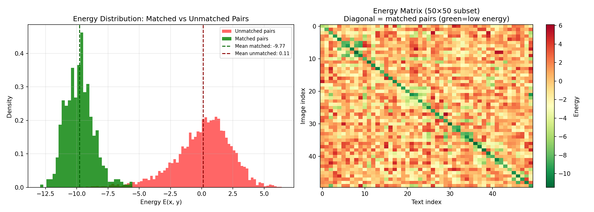
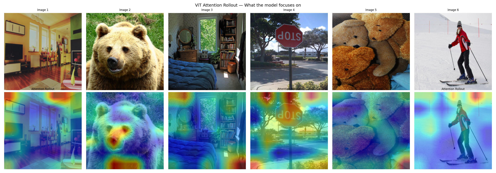
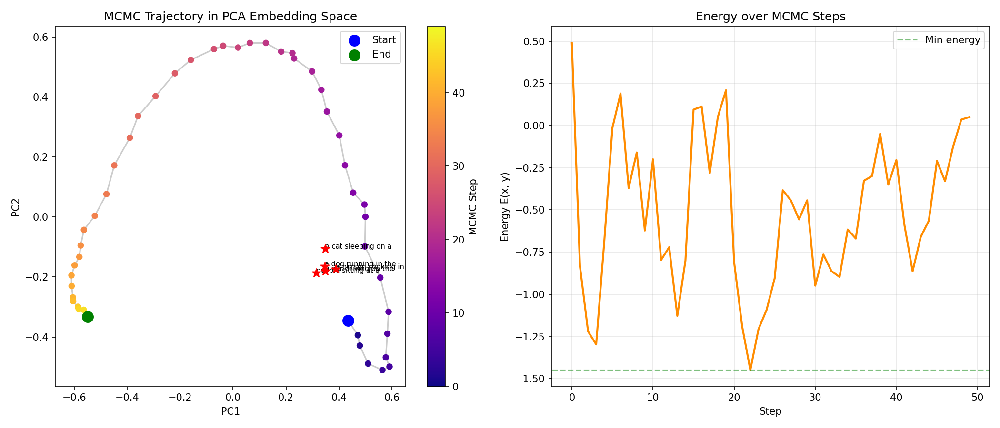
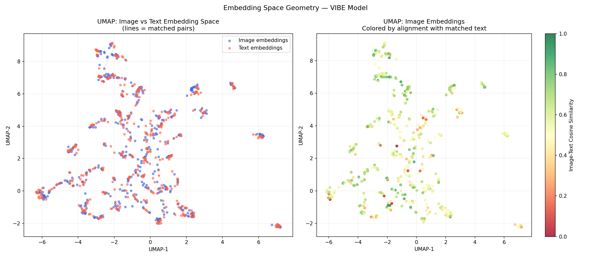
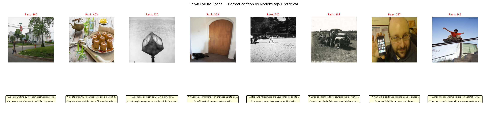

# ⚡ VIBE — Visual-Intent Bridge via Energy Scoring

A multimodal AI system that scores image-text alignment using **Energy-Based Models** and **Langevin MCMC dynamics**, built on a frozen CLIP ViT-B/32 backbone trained with InfoNCE contrastive loss on MS-COCO.

[](https://n7fxawrsbnpzxoxpfwqpwk.streamlit.app/)

---

## 📊 Results

| Metric | Score |
|---|---|
| R@1 | 0.528 |
| R@5 | 0.868 |
| R@10 | 0.938 |
| Energy Gap | 9.77 |

---

## 🖼 Visualizations

### Energy Distribution — Matched vs Unmatched Pairs

> Matched pairs (green) cluster at energy ≈ −9.77, unmatched pairs (red) at ≈ +0.11. The sharp separation confirms the model has learned a meaningful energy landscape.

### ViT Attention Rollout — What the Model Focuses On

> Attention rollout across 6 validation images. The model correctly focuses on the primary subject in each scene.

### Langevin MCMC Trajectory

> Starting from random noise in embedding space, Langevin dynamics walks toward low-energy (aligned) regions. The arc shape is characteristic of sampling on a hypersphere.

### UMAP Embedding Space

> Image (blue) and text (red) embeddings occupy the same semantic regions — matched pairs land close together. The right plot colors image embeddings by alignment score with their matched caption.

### Failure Cases

> Top-8 hardest retrievals. Failures cluster around black & white images, minimalist scenes, and close-up objects — consistent with known limitations of CLIP's visual features.


## 🏗 Architecture

```
Image Input → ViT Encoder (frozen) → Image Embedding (512d)
                                              ↘
                                    E(x,y) = −fᵥ(x)ᵀfₜ(y) / τ
                                              ↗
Text Input  → BERT Encoder (frozen) → Text Embedding (512d)
                    ↑
         Langevin MCMC refines text toward low energy
```

### Components

| Component | Details |
|---|---|
| Vision Encoder | CLIP ViT-B/32 (frozen) |
| Text Encoder | CLIP Text Transformer (frozen) |
| Projection Heads | 2-layer MLP 512→512 (learnable) |
| EBM Head | Learnable temperature τ |
| Dataset | MS-COCO 2017 val (5,000 pairs) |
| Training | InfoNCE loss, AdamW, batch size 256, 25 epochs |

---

## 🧮 Math

### Energy Function

The EBM assigns a scalar energy to every image-text pair:

$$E(x, y) = -\frac{f_v(x)^\top f_t(y)}{\tau}$$

- Lower energy = higher compatibility between image and text
- $f_v(x)$ — L2-normalized image embedding (ViT encoder)
- $f_t(y)$ — L2-normalized text embedding (BERT encoder)
- $\tau$ — learnable temperature parameter

### Probability Distribution

$$p(y|x) = \frac{e^{-E(x,y)}}{\sum_j e^{-E(x,y_j)}}$$

### InfoNCE Contrastive Loss

$$\mathcal{L} = -\frac{1}{N}\sum_{i=1}^{N}\log\frac{e^{-E(x_i,y_i)}}{\sum_{j=1}^{N}e^{-E(x_i,y_j)}}$$

- Diagonal of energy matrix = matched pairs (pulled to low energy)
- Off-diagonal = mismatched pairs (pushed to high energy)
- With random embeddings, expected loss ≈ log(N)
- Equivalent to maximizing mutual information I(x; y)

### Langevin MCMC Dynamics

$$y_{t+1} = y_t - \frac{\alpha}{2}\nabla_y E(x, y_t) + \sqrt{\alpha}\,\varepsilon, \quad \varepsilon \sim \mathcal{N}(0, I)$$

- Gradient term pushes toward low energy (better alignment)
- Noise term ensures exploration (prevents collapse)
- Step size α annealed linearly to zero for stability

### Connection to Diffusion Models

The Langevin update is mathematically identical to the DDPM reverse diffusion step:

| VIBE (EBM) | DDPM (Diffusion) |
|---|---|
| $y_{t+1} = y_t - \frac{\alpha}{2}\nabla_y E + \sqrt{\alpha}\varepsilon$ | $x_{t-1} = \frac{1}{\sqrt{\alpha_t}}(x_t + (1-\alpha_t)s_\theta) + \sigma_t\varepsilon$ |
| Score = $-\nabla E(x,y)$ | Score = $\nabla \log p(x_t)$ |
| Text embedding space | Pixel / latent space |

Both learn the **gradient of the log probability** — the score function.

---

## 🖥 Streamlit App

The app has three interactive tabs:

### 🔍 Cross-Modal Retrieval
- Browse 100 validation images
- Model retrieves top-5 most aligned captions from 5,000-caption COCO pool
- Energy scores visualized as bar chart
- ViT attention rollout shows what the model focuses on

### 🌄 EBM Landscape Explorer
- Upload your own image or pick a sample
- Edit candidate captions (auto-populated with top-5 relevant + 3 distractors)
- Energy bar chart, 2D PCA landscape, Langevin MCMC trajectory

### 📐 Math Explainer
- Every chart computed live from the trained model
- Interactive τ slider showing effect on probability distribution
- InfoNCE energy matrix with real embeddings
- Per-layer ViT attention explorer
- Live MCMC on your image with step size comparison
- EBM ↔ Diffusion connection with score function visualization

---

## 🚀 Setup

### Prerequisites
- Python 3.10+
- CUDA-capable GPU (6GB+ VRAM)

### Installation

```bash
git clone https://github.com/Shivram08/VIBE.git
cd VIBE
python -m venv vibe_env
vibe_env\Scripts\activate       # Windows
pip install -r requirements.txt
```

### Download Data

```bash
python data/download_coco.py
```

### Download Weights

Download `vibe_lean.pt` from the [releases page](https://github.com/Shivram08/VIBE/releases) and place in `checkpoints/`.

### Run App

```bash
python -m streamlit run app/main.py
```

### Train from Scratch

```bash
python src/train.py
```

Or use the Kaggle notebook: `notebooks/kaggle_train.py`

---

## 📁 Repository Structure

```
vibe/
├── data/
│   └── download_coco.py          # COCO val2017 downloader
├── src/
│   ├── dataset.py                # COCODataset + annotation parser
│   ├── encoders.py               # CLIP image/text encoders + projection heads
│   ├── ebm.py                    # EBM head with learnable temperature
│   ├── losses.py                 # InfoNCE contrastive loss
│   ├── model.py                  # VIBEModel (full pipeline)
│   ├── train.py                  # Training loop with W&B logging
│   ├── evaluate.py               # Recall@K evaluation
│   ├── mcmc.py                   # Langevin MCMC sampler
│   ├── caption_utils.py          # Dynamic caption selection utilities
│   └── config.py                 # Hyperparameter configuration
├── app/
│   ├── main.py                   # Streamlit entry point
│   ├── tab_retrieval.py          # Cross-Modal Retrieval tab
│   ├── tab_landscape.py          # EBM Landscape Explorer tab
│   └── tab_math.py               # Math Explainer tab
├── notebooks/
│   └── kaggle_train.py           # Kaggle training script
├── assets/                       # Visualizations and cached data
├── checkpoints/                  # Model weights (not tracked)
└── requirements.txt
```

---

## 📈 Training Details

| Hyperparameter | Value |
|---|---|
| Backbone | CLIP ViT-B/32 (frozen) |
| Projection head | 2-layer MLP, GELU, LayerNorm |
| Batch size | 256 |
| Optimizer | AdamW |
| LR (EBM head) | 1e-3 |
| LR (projection) | 1e-4 |
| Weight decay | 0.01 |
| Scheduler | CosineAnnealingLR |
| Epochs | 25 |
| Initial τ | 0.07 |
| Final τ | 0.055 |
| Training GPU | Kaggle T4 |

---

## 🔬 Evaluation

```
=== Image-to-Text Recall@K (full 5k) ===
  R@1  : 0.4248  (2124/5000 correct)
  R@5  : 0.7564  (3781/5000 correct)
  R@10 : 0.8614  (4307/5000 correct)

=== Energy Gap Analysis ===
  Mean E(matched)   : -9.6558
  Mean E(unmatched) :  0.1188
  Energy gap        :  9.7746
```

---

## 🙏 Acknowledgements

- [OpenAI CLIP](https://github.com/openai/CLIP) for pretrained vision-language encoders
- [open_clip](https://github.com/mlfoundations/open_clip) for PyTorch CLIP implementation
- [MS-COCO](https://cocodataset.org) for the image-caption dataset
- [Weights & Biases](https://wandb.ai) for experiment tracking